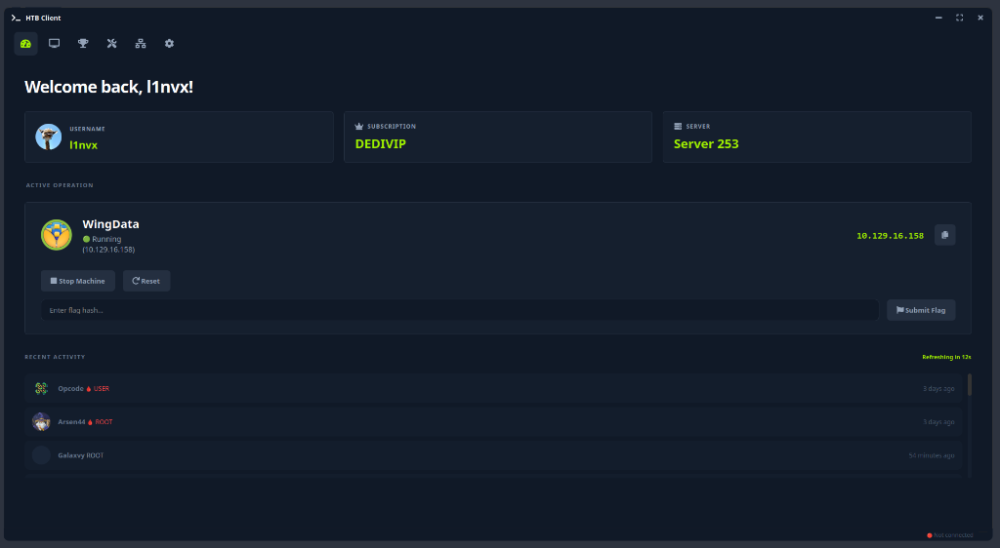
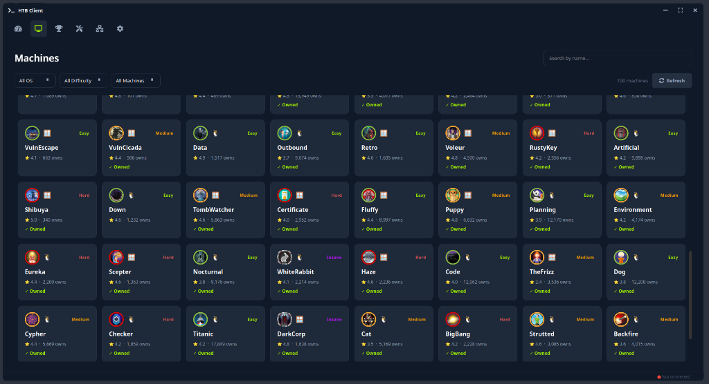
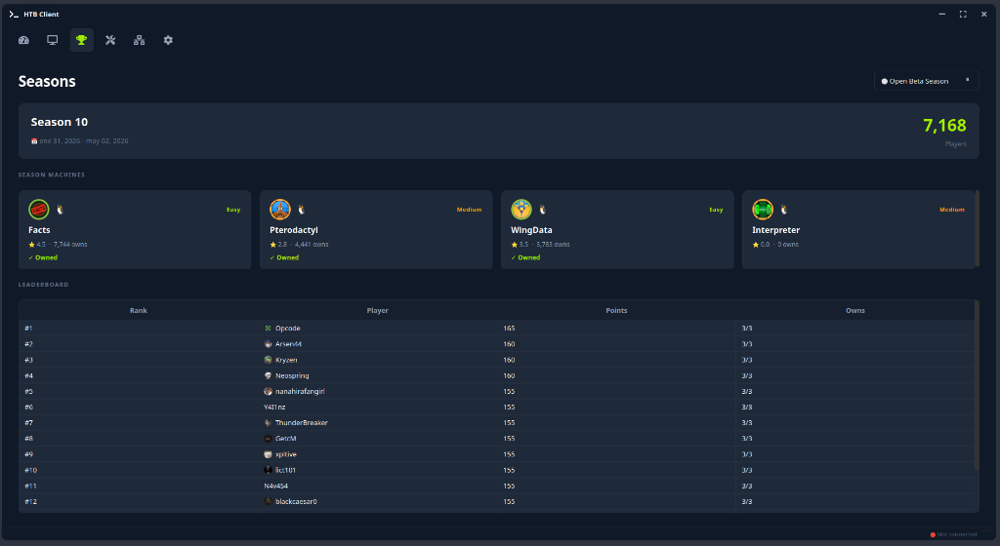
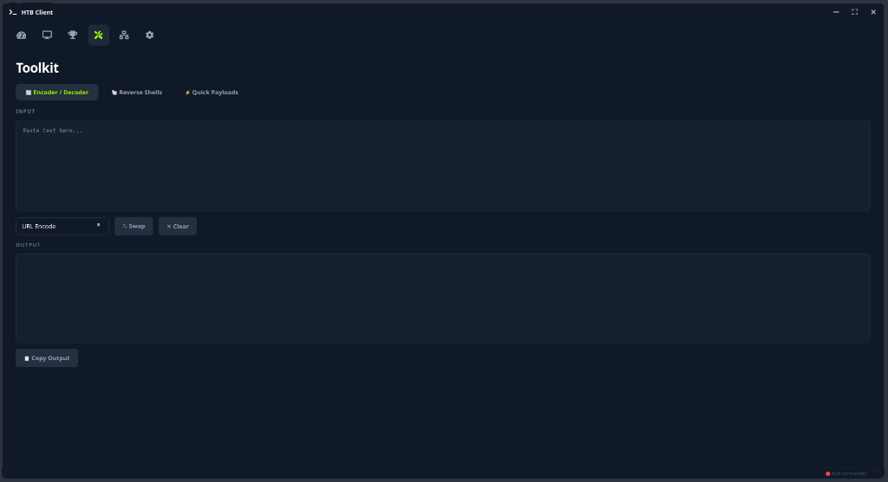
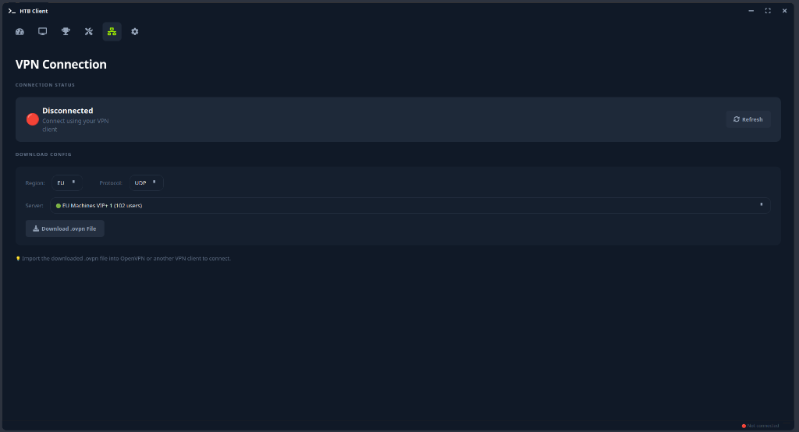

# HTB Desktop Client

A modern, feature-rich **unofficial** desktop client for [HackTheBox](https://hackthebox.com) built with Python and PySide6.

> [!NOTE]
> This project is developed independently and is **not** affiliated with, endorsed by, or connected to Hack The Box.



## Features

- **Dashboard** : view your profile, active machine, and recent activity at a glance
- **Machines** : browse, search, and filter all available machines. Spawn, reset, terminate, and submit flags
- **Seasons** : track current season machines, leaderboard, and your progress
- **Toolkit** : built-in encoder/decoder, reverse shell generator, and quick payloads (XSS, SQLi, SSTI, LFI, etc.)
- **VPN** : download `.ovpn` configs directly from the app
- **Auto Spawn** : set a timer to automatically spawn unreleased machines the moment they go live
- **Flag Watcher** : monitors your clipboard for MD5 hashes and auto-submits flags, app-wide (background polling)

## Screenshots

| Machines | Seasons |
|----------|---------|
|  |  |

| Toolkit | VPN |
|---------|-----|
|  |  |

## Installation with pipx (Recommended)

To install globally in an isolated environment:

```bash
# From source directory
pipx install .

# Or directly from GitHub
pipx install git+https://github.com/Goultarde/htb-gui-pipx.git
```

After installation, you can run the application from anywhere using:
```bash
htb-gui
```

## Configuration

The application needs your HackTheBox API token. Get it from
https://app.hackthebox.com/profile/settings

The token is resolved in this order:

1. **`.env` file** (override, optional): if a `.env` containing a valid
   `HTB_API_TOKEN` is found (in the package directory, the project root, or the
   current working directory), it takes priority and the JSON config is ignored.
2. **`~/.htb_client/config.json`** (persistent store, default): used when no
   `.env` token is set.

The persistent store is always `~/.htb_client/config.json`. When you set or
change the token from the in-app **Settings** page, it is written there. The
`.env` file is never modified by the app, it is only an override (handy for
development).

Optional environment variables (read from `.env`):

```bash
HTB_API_TOKEN=your_api_token_here
HTB_DEBUG=false
```

## Development Setup

1. Clone the repository:
```bash
git clone https://github.com/Goultarde/htb-gui-pipx.git
cd htb-gui-pipx
```

2. Install dependencies:
```bash
pip install -r requirements.txt
```

3. Configure your API token (see the [Configuration](#configuration) section).
   For a quick dev override, create a `.env` file in the project root:
```bash
cp .env.example .env
```
Then edit `.env` and set `HTB_API_TOKEN`. Otherwise, set the token from the
in-app Settings page (saved to `~/.htb_client/config.json`).

4. Run the application:
```bash
python -m htb_gui.main
# or
python htb_gui/main.py
```

## Requirements

- Python 3.10+
- PySide6
- requests
- urllib3
- python-dotenv
- qtawesome
